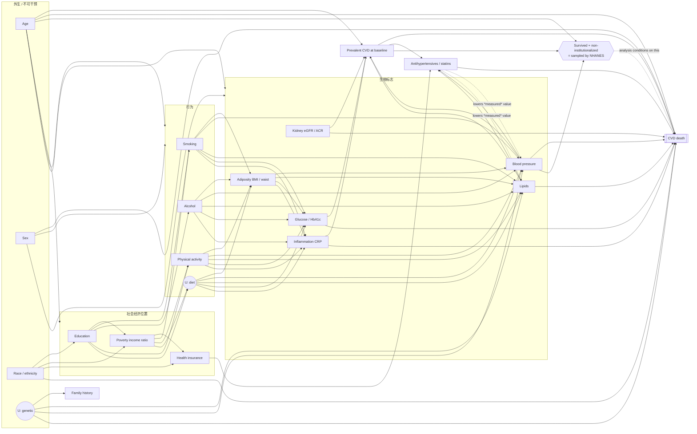

# CardioTrace 研究设计文档（活文档）

> 这份文档记录**每一个决策节点的选项、权衡、最终选择和理由**。
> 规则：任何进入代码的决定，先在这里写下"为什么"。没写在这里的选择，不许写进代码。
> 这份文档就是答辩时对着讲的东西，也是导师问"你为什么这么做"的唯一出处。

| 状态 | 含义 |
|---|---|
| 🔒 已锁定 | 决定已做，理由已写，不再讨论 |
| 🔄 进行中 | 正在讨论 |
| ⬜ 未开始 | 还没到 |

---

## 当前状态（唯一权威）

> **本表是 16 个节点状态的唯一出处。** 路线图不带状态列，章节标题不带状态标记，
> 下面的决策记录是历史。要改状态，只改这一张表。
>
> 「落地位置」这一列由 `tests/test_doc_consistency.py` 逐条断言存在——
> 一个指向已删文件的状态是一条读不出真假的状态。

| # | 节点 | 状态 | 落地位置 |
|---|---|---|---|
| 1 | 研究问题与 estimand | 🔒 | 本文档 §节点 1；三个 Part 的 estimand 分列 |
| 2 | 目标人群与分析样本 | 🔒 | `src/cohort.py` · `reports/tables/strobe_part3.csv` |
| 3 | 结局定义与效度 | 🔒 | `src/cohort.py`（UCOD ∈ {1,5}，1999–2014，止于 2019-12-31） |
| 4 | 识别假设（DAG） | 🔒 | 本文档 §节点 4 · `src/models.py`（E1/E2/P 三套变量集） |
| 5 | 数据源与周期选择 | 🔒 | `src/cohort.py`（`CYCLES`） · `src/descriptive.py`（`CYCLE_LABEL`） |
| 6 | 变量普查与筛选规则 | 🔒 | `data/build_catalog.py` · `data/apply_selection_rules.py` |
| 7 | 可重复性契约 | 🔄 | `data/download_from_catalog.py` · `data/download_mortality.py`（SHA-256 manifest 已实现）。**未收口**：`data/download.py` 是被取代的旧下载器，仍需移入 `legacy-invalid/` |
| 8 | 分层架构 | 🔒 | `dbt/models/staging/` → `dbt/models/mart/` · `src/etl.py` |
| 9 | 仪器与口径桥接 | 🔒 | `src/biomarkers.py`（`CREATININE_CALIBRATION`，CDC 官方系数） |
| 10 | 编码决策 | 🔒 | `data/build_variable_crosswalk.py` · `src/cohort.py`（每条 CASE WHEN 附依据） |
| 11 | 缺失机制与插补 | 🔄 | `src/missingness.py` · `reports/tables/part3_missing_sensitivity.csv`。**未收口**：IPCW 处理的是截尾，完整病例的选择偏差仍未解决 |
| 12 | 抽样设计的正确处理 | 🔒 | `src/descriptive.py`（Taylor 线性化 + 设计自由度 t 分位） · `scripts/crosscheck_survey.R`（`svycoxph` 独立复核）。**已知偏离**：1999–2002 未用 4 年权重，代价已量化，见 `scripts/check_fouryear_weights.py` |
| 13 | 描述性分析 | 🔒 | `src/descriptive.py` · `src/changepoint.py` · `src/ascertainment.py` |
| 14 | 模型与验证策略 | 🔒 | `src/models.py` · `scripts/fit_survival_models.py`（按周期前向验证） |
| 15 | 校准、基准、敏感性 | 🔄 | 协议已锁定（`docs/pce-benchmark.md` §3.5，四条）。**未收口**：PCE 头对头尚未实现 |
| 16 | 报告规范与可重复包 | 🔄 | `scripts/render_report.py` · `reports/tables/strobe_part3.csv`。**未收口**：TRIPOD 清单与可重复包尚未成文 |

---

## 路线图：5 个阶段 · 16 个决策节点

> 这张表**不带状态**。状态只有一处，就是上面的「当前状态」表——
> 从前这里也有一列状态，两套并存，只有决策记录在维护，路线图停在 2026-08-09，
> 于是同一个节点在同一份文档里能读出两个答案。

### 阶段一 · 研究设计（不碰代码）

| # | 节点 | 核心问题 |
|---|---|---|
| 1 | 研究问题与 estimand | 你到底要估计什么量？描述、因果、还是预测？ |
| 2 | 目标人群与分析样本 | 结论想推广到谁？谁被排除了、为什么？ |
| 3 | 结局定义与效度 | 自报诊断能代表"有病"吗？误分类往哪个方向偏？ |
| 4 | 识别假设（DAG） | 每个变量是混杂、中介、对撞，还是纯预测因子？ |

### 阶段二 · 数据获取

| # | 节点 | 核心问题 |
|---|---|---|
| 5 | 数据源与周期选择 | 哪些周期？为什么排除某些？空窗怎么处理？ |
| 6 | 变量普查与筛选规则 | 如何证明"我们没有漏掉重要变量"？ |
| 7 | 可重复性契约 | 别人怎么确认跑的是同一份数据？ |

### 阶段三 · 数据处理

| # | 节点 | 核心问题 |
|---|---|---|
| 8 | 分层架构 | raw 必须是 raw；harmonization 该在哪一层？ |
| 9 | 仪器与口径桥接 | 血压计换代、CRP 换试剂，怎么保证 25 年可比？ |
| 10 | 编码决策 | 每一个 CASE WHEN 的依据 + 敏感性分析 |
| 11 | 缺失机制与插补 | 缺失是随机的、还是设计造成的？ |

### 阶段四 · 分析与建模

| # | 节点 | 核心问题 |
|---|---|---|
| 12 | 抽样设计的正确处理 | 权重怎么合并？方差怎么算？CI 从哪来？ |
| 13 | 描述性分析 | 年龄标准化、趋势检验 |
| 14 | 模型与验证策略 | 验证怎么切？切错了性能就是假的 |
| 15 | 校准、基准、敏感性 | 比 Framingham 好在哪？结论稳不稳？ |

### 阶段五 · 报告

| # | 节点 | 核心问题 |
|---|---|---|
| 16 | 报告规范与可重复包 | STROBE/TRIPOD、多重比较、limitations |

---

## 节点 1 · 研究问题与 estimand

### 1.1 为什么这是第一个节点

**导师说"每个点都解释不通"，根因就在这里。**

因为一个技术选择"对不对"，不存在脱离研究问题的答案。举例：

- 「该不该调整年龄？」→ 做**描述**要（年龄标准化），做**预测**不要（年龄是最强预测因子，扔了模型就废了）
- 「该不该把服降压药放进模型？」→ 做**预测**可以，做**因果**要先看 DAG，可能是中介、也可能是对撞
- 「AUC 0.86 好不好？」→ 做**预测**是个指标，做**因果**这个数字毫无意义

所以先定研究问题，下游每一个选择就自动有了判据。**这就是"解释得通"的来源。**

### 1.2 三种目标，方法论完全不同（最关键的一张表）

| | 描述性 Descriptive | 因果 Causal | 预测 Predictive |
|---|---|---|---|
| **问题形式** | 有多少？变化多大？ | 如果改变 X，Y 会怎样？ | 给定信息，能不能猜准 Y？ |
| **必须有** | 抽样权重、标准化、CI | DAG、混杂调整、识别假设 | 时序/外部验证、校准 |
| **不需要** | 混杂调整、DAG | 高 AUC | 因果解释 |
| **典型指标** | 加权率 + 95%CI | 调整后 OR/RR + CI | AUC、PR-AUC、Brier、calibration slope |
| **典型错误** | 不加权、不标准化 | Table 2 fallacy | 用 SHAP 讲因果、验证集泄漏 |

### 1.3 当前项目的诊断

项目现在**同时声称做了三件**，但**只用了第三件的工具**：

| 你做的分析 | 它的目标性质 | 你用的工具 | 是否匹配 |
|---|---|---|---|
| 25 年患病率趋势 | 描述 | 加权点估计 | 半对（缺标准化、缺 CI） |
| 种族公平性 | 描述 + 因果 | 分组均值 | 不对（无混杂调整、无误分类讨论） |
| 疫情前后对比 | 因果（准实验） | 两组均值差 | **不对**（无识别策略） |
| 6 个结局的 ML | 预测 | XGBoost + AUC | 口径不对（横断面 prevalent 结局） |
| SHAP 解释 | **因果**（你在这么解读） | 预测模型的归因 | **错**（Table 2 fallacy） |

> **一句话诊断：三种目标混在一条流水线里，每一种都用错了工具。**

这句话本身就是给导师最好的答案——因为它说明你**知道**三者的区别，而不是不知道。

### 1.4 重构主线：拆成三个互相独立的 Part

一条流水线做三件事必然做不好。拆开，各用各的方法论：

#### Part 1 — 描述性：25 年 CVD 负担与健康公平

- **Estimand**：美国非住院成人 20+ 中，自报医生诊断 CVD 的**年龄标准化加权患病率**，及其随周期的变化
- **工具**：survey-weighted prevalence + direct age-standardization（2000 US standard population）+ Taylor linearization CI + 线性趋势检验
- **不需要**：ML、SHAP、AUC
- **改造成本**：最低。这是最快能站住的一块

#### Part 2 — 准实验：COVID 对心血管风险因素的影响

- **Estimand**：若无 COVID，2021-2022 的患病率/风险因素水平会是多少（反事实），与实测的差
- **工具**：中断时间序列（ITS / segmented regression），用 1999–2018 的 10 个点拟合趋势外推反事实
- **前置条件**：年龄标准化（否则人口老化算进去）+ 血压仪器桥接（否则换机器算进去）
- **这是最有"研究味"的一块**

#### Part 3 — 预测：CVD 风险模型

- **必须先选路线**（见 1.5），否则"预测"这个词站不住
- 若做：必须有时序外推验证 + 校准评估 + 与 Framingham/ASCVD PCE 对比
- **绝不用 SHAP 做因果解释**；SHAP 只能说"模型依赖什么"，不能说"什么导致疾病"

### 1.5 Part 3 的三条路线（待拍板）

| | 路线 A：关联研究 | 路线 B：筛查模型 | 路线 C：纵向队列 |
|---|---|---|---|
| **做什么** | 不再叫 prediction，改报调整后 OR + 95%CI | 只用不受治疗影响的先行变量，定位为"发现未确诊者" | 接 NHANES Linked Mortality File，做 CVD 死亡的生存分析 |
| **结局** | 自报现患 CVD | 自报现患 CVD | **CVD 死亡（硬结局 + 随访时间）** |
| **解决了什么** | 承认横断面局限，口径诚实 | 部分绕开反向因果 | **反向因果、"预测"名不副实** |
| **没解决什么** | 反向因果仍在，只是不再声称预测 | 幸存者偏倚仍在 | **幸存者偏倚仍在**（NHANES 只抽非住院人口，早年死于 CVD 的人从未有机会入样，见 §4.2 第 4 条）；只能预测死亡，不能预测发病 |
| **新增数据** | 无 | MCQ300（家族史）、SMQ 完整吸烟史 | **LMF（小文件，SEQN 对齐，免费公开）** |
| **要学的东西** | 无 | 无 | 生存分析 + 复杂抽样下的 Cox |
| **工作量** | 1–2 周 | 2–3 周 | 4–6 周 |
| **论证强度** | 中（但完全站得住） | 中高 | **高** |

---

### 1.6 节点 1 决定（2026-08-09）

- **项目用途**：求职作品集
- **Part 3 路线**：C —— 接 NHANES Linked Mortality File，做 CVD 死亡的生存分析

**理由**：作品集的敌人不是"不够严谨"，是"跟别人的一样"。XGBoost 跑表格数据的项目招聘方一天看八个；
"在复杂抽样设计下把死亡随访 link 上去做生存分析"几乎没人做。路线 C 对求职的价值在**稀缺**，
而不在严谨——严谨是附赠的。

**附带约束**：不让 Part 3 吞掉项目。Part 1（描述性）撑门面，让 README 十分钟能看完；Part 3 撑深度。

---

## 节点 3 · 结局定义 —— LMF 可行性核查结果（2026-08-09）

下载器：`data/download_mortality.py`。10 个周期全部到手，共约 4.8 MB，带 SHA-256 manifest。
布局（固定宽度列位）是**实测**得到的，不是抄 codebook——CDC 挡自动抓取，PDF 拿不到。

### 3.1 队列规模

| 指标 | 数值 |
|---|---|
| 合格参与者（ELIGSTAT=1，18+） | **59,064** |
| 总死亡 | **9,249** |
| 心脏病死亡（UCOD_LEADING=1） | **2,406** |
| 脑血管病死亡（UCOD_LEADING=5） | 519 |
| 中位随访 | 2.0 年（2017-2018）~ 19.5 年（1999-2000） |

对比现在横断面模型的事件数（心绞痛 1,805 例），**事件预算宽裕得多**。按 EPV ≥ 10，
2,406 例心脏病死亡可支撑约 240 个参数。

### 3.2 🔴 硬约束：后两个周期的死因编码被压缩了

实测结果，不是文档推断：

| 周期 | UCOD_LEADING 实际出现的码 |
|---|---|
| 1999-2000 … 2013-2014 | 1,2,3,4,5,6,7,8,9,10 |
| **2015-2016** | **仅 1, 2, 10** |
| **2017-2018** | **仅 1, 2, 10** |

**脑血管病死亡（码 5）在最后两个周期被并进了"其他"（码 10）。**

折叠的证据（不是"碰巧没有"）：码 10 的占比从 1999–2014 的 22–28% 跳到 2015-2016 的 **52.9%**、
2017-2018 的 **51.0%**。占比翻倍 = 码 3–9 被并进去了。

后果：若把 CVD 死亡定义成 `ucod ∈ {1,5}` 却仍用全部 10 个周期，2015-2018 的 CVD 死亡率会
**人为偏低**，因为中风死亡藏在 10 里。这不是真实下降，是编码口径变化——与血压仪器换代同一类陷阱。

#### 3.2.1 四个方案的量化比较

| 方案 | 事件数 | 基线队列 | 周期数 | EPV 预算(≥10) |
|---|---|---|---|---|
| A 码1 · 全 10 周期 | 2,406 | 59,064 | 10 | 240 参数 |
| **B 码1+5 · 仅 1999-2014** | **2,825** | 47,281 | 8 | **282 参数** |
| A′ 码1 · 仅 1999-2014 | 2,306 | 47,281 | 8 | 230 参数 |
| C 码1+5 · 全 10 周期 | 2,925 | 59,064 | 10 | **有偏，不可用** |

#### 3.2.2 决定（**修正**了本文件同日早先的决定）

- **主结局 = 心脏病 + 脑血管病死亡（UCOD_LEADING ∈ {1,5}），队列 1999–2014（8 个周期）**
- **敏感性分析 = 心脏病死亡（UCOD=1），全 10 个周期** —— 检验结论是否依赖这个选择

**理由（三条，缺一不可）**：

1. **B 的事件数反而更多**（2,825 vs 2,406）。2015-2018 两个周期加了 11,783 人，
   却只贡献 **100 个事件（4.2%）**，因为中位随访仅 3.0 年。
2. **生存分析里加人 ≠ 加信息**，加的是「人 × 随访时间」。横断面的"样本越大越好"直觉在这里失效。
   这是从横断面转向纵向后必须换掉的第一个思维习惯。
3. **拿掉中风不是"结局变小"，是"结局换了"**。中风占 CVD 死亡的 **18.4%**，且危险因素画像与
   心脏病不同（中风更受血压和种族驱动）。A 与 B 不是同一研究的两种精度，是两个不同的研究。

### 3.3 🔴 随访起点：必须锚在体检（exam），不是访谈（interview）

实测：`permth_exm` 有 **2,811 例缺失**（59,064 中），`permth_int` **零缺失**。

含义：这 2,811 人**接受了访谈但没做体检**。我们的暴露变量（血压、血脂、HbA1c）全部来自体检，
所以这些人必须排除，而且要写进 STROBE 流程图。

**决定**：
- 随访时间用 `permth_exm`（暴露测量的那一刻起算），配 MEC 体检权重 `WTMEC2YR` —— 两者口径一致。
- 用 `permth_int` 配访谈权重是另一套自洽的选择，但会让暴露和随访起点错位，**不采用**。

### 3.4 🔴 为什么必须做生存分析，不能做「死没死」的逻辑回归

随访时长按周期从 19.5 年递减到 2.0 年（全部在 2019-12-31 行政删失）。

如果直接对「死亡 = 是/否」做逻辑回归，模型会把**随访时长**学成风险因素——
1999-2000 的人"更容易死"，仅仅因为他们被观察了 20 年。

**这一条本身就是对导师"为什么用 Cox 而不是逻辑回归"的完整回答**，而且是从数据里看出来的，
不是从教科书上抄的。

### 3.5 🔴 时间范围：Part 3 的随访全部在疫情之前，这是**有意的**

**常见误解**："LMF 随访只到 2019-12-31，那怎么预测疫情之后的心血管问题？"

**回答：它不能，也不该。Part 2 和 Part 3 是两个不同的研究，用不同的样本回答不同的问题。**

| | Part 2（COVID） | Part 3（生存分析） |
|---|---|---|
| 问题 | 疫情是否改变了 CVD 负担与危险因素水平 | 基线危险因素 → CVD 死亡风险 |
| 数据 | NHANES 横断面序列 1999–2022 | NHANES 1999–2014 + LMF 随访至 2019-12-31 |
| 设计 | 中断时间序列（ITS） | Cox 比例风险 / 竞争风险 |
| 含 2021-2022？ | **是**（这是识别 COVID 效应的关键） | **否**（LMF 无该周期 linkage） |

**为什么"随访止于 2019"对 Part 3 是优点而非缺陷**：

随访窗口完全落在疫情之前，意味着结局**没有被疫情死亡污染**。若随访延伸到 2020–2022，会同时出现三个麻烦：

1. COVID 死亡是巨大的**竞争风险**，必须换成 Fine-Gray 等竞争风险模型
2. COVID 死亡常带心血管类的伴随死因，死因归类本身被扰动
3. 疫情期间医疗中断改变了诊断与死亡证明的开具行为

一个干净的疫情前窗口，让"经典 CVD 危险因素 → 心血管死亡"这个问题能被干净地回答。

**必须写进 limitations 的诚实边界**：模型的训练与验证**全部基于疫情前数据**，
它能否外推到 2020 年后的人群，**用当前公开数据无法检验**。这不隐瞒——
说清楚自己结论的边界，本身就是论证质量的一部分。

**分叉点（若 LMF 2022 版确已发布）**：随访可延伸至 2022，那时可以研究疫情期心血管死亡，
但**必须**把 COVID 死亡作为竞争风险处理。这是另一个研究，不在当前范围内。

### 3.6 待办（需要 Docker 起来才能确认）

- [ ] LMF 按 SEQN 与 `mart_cv_master` join，确认年龄 ≥20 且有 MEC 权重后的最终事件数
- [ ] STROBE 流程图：从 101,316 条 LMF 记录 → 最终分析样本，每一步的排除数和原因
- [ ] 确认 LMF 2022 版（随访到 2022）是否已发布 —— 搜索显示存在 2026-01 的数据字典，
      但标准 FTP 路径下没有对应的 NHANES 公开文件，CDC 网页挡自动抓取。**需人工在浏览器确认。**

---

## 完整设计规格（2026-08-09）

### S.0 三个 Part 的总览

| | Part 1 描述 | Part 2 准实验 | Part 3 纵向队列 |
|---|---|---|---|
| **问题** | 25 年 CVD 负担与族裔差距如何变化 | 疫情是否改变了 CVD 负担与危险因素 | 基线危险因素 → CVD 死亡 |
| **Estimand** | 年龄标准化加权患病率（按周期） | 反事实（无疫情）与实测之差 | 风险比 / 累积发生率 |
| **样本** | 1999–2023，11 周期，成人 20+ | 同左 | **1999–2014，8 周期** |
| **N** | 62,877 | 同左 | **20,736**（最终分析样本） |
| **结局** | 自报医生诊断 CVD | 同左 + 连续危险因素 | **CVD 死亡（UCOD ∈ {1,5})** |
| **事件数** | — | — | **925**（另有 2,711 竞争死亡） |
| **方法** | 加权率 + 直接年龄标准化 + 设计基 CI | 模型期望对照（非中断时间序列） | 病因特异 Cox（病因）+ 两个病因特异 Cox 组合出 CIF（预测） |
| **不用** | ML、SHAP | ML | SHAP 做因果解释 |

**三个 Part 用三个不同的样本，这是有意的，必须在 README 首屏说清楚。**

> 上表的 N 与事件数是**最终值**，出处是 `reports/tables/strobe_part3.csv` 与
> `data/processed/cohort_part3.csv.gz`。此前这里写的是 45,035 / 2,513，那是
> **排除阶梯中段**的数（「完成 MEC 体检」那一步），不是分析样本——
> 一个中间量放在写着「样本」的格子里，读起来和最终值没有区别。

### S.1 数据来源清单（具体到文件）

#### 已有，无需重下

| 来源 | 主机 | 用于 |
|---|---|---|
| NHANES 核心调查 11 周期 × 17 模块（`data/raw/`） | `wwwn.cdc.gov` | Part 1/2/3 的暴露与协变量 |
| LMF 2019 版 10 周期（`data/raw_mortality/`） | `ftp.cdc.gov` | Part 3 的结局与随访时间 |

#### 需要补的（按优先级）

| 模块 | 内容 | 为什么必须 | 成本 |
|---|---|---|---|
| **MCQ300A/B/C** | 一级亲属早发心脏病史 | Framingham/PCE 核心变量；DAG 里代理未测遗传因素 | **零** —— MCQ 文件已下载，只需在 staging 里抽列 |
| **RXQ_RX** | 处方药（他汀、降压药） | 无它则无法处理"治疗效应偏倚"，DAG 里的 MEDS 节点悬空 | 新下载，每周期 1 文件 |
| **HIQ** | 医保 | 族裔差距分析的关键混杂（诊断可及性） | 新下载 |
| **ALQ** | 饮酒 | 经典混杂，J 型关联 | 新下载 |
| **ALB_CR** | 尿白蛋白肌酐比 | CKD 是 CVD 风险倍增因子；BIOPRO 的肌酐不够 | 新下载 |
| **SLQ** | 睡眠 | 2005 年起才有，作探索性变量 | 新下载 |
| **CDQ** | Rose Angina 问卷（1999–2012） | Part 1 的结局效度检验：症状学定义 vs 自报诊断 | 新下载 |

#### 需要外部参照数据

| 数据 | 来源 | 用于 |
|---|---|---|
| 2000 年美国标准人口年龄构成 | NCHS *Healthy People 2010 Statistical Notes No. 20*（Klein & Schoenborn 2001） | Part 1/2 的直接年龄标准化。**必须用官方权重，不能自造** |
| ASCVD Pooled Cohort Equations 系数 | Goff et al. 2013 ACC/AHA 指南附表 | Part 3 的基准对比 |

### S.2 Part 3 的样本定义（STROBE 流程，逐步排除）

```
NHANES 1999–2014 受访者                         82,091
  → 与 LMF 合并                                  82,091          2,825 例 CVD 死亡
  → ELIGSTAT = 1（年满 18、可链接）              47,281  −34,810  2,825
  → 完成 MEC 体检                                45,035   −2,246  2,513
  → 年龄 40–79（见 S.4 决策）                    24,106  −20,929  1,530
  → WTMEC2YR > 0                                 24,106       −0  1,530
  → 基线 CVD 状态已知                            24,103       −3  1,530
  → 基线无自报 CVD（一级预防，见 S.4）           20,737   −3,366    925
  → 每个死亡者的死因均已编码                     20,736       −1    925
  = 最终分析样本                                 20,736                925
```

> 这不是手抄的。上表由 `scripts/build_cohort_results.py` 写入
> `reports/tables/strobe_part3.csv`，`reports/tables/pce_cascade.csv` 直接复用同一张表，
> `tests/test_doc_consistency.py` 断言此处每个数字与产物一致。

**每一步的排除数和被排除者的特征分布都要报告。** 当前主表 `mart_cv_master` 的
62,890 之所以"没有出处链条"，就是因为缺这张表。

### S.3 关键量级（实测）

| 指标 | 排除前（45,035，2026-08-09 探路） | **最终分析样本（20,736）** |
|---|---|---|
| 随访人年 | 517,478 | **235,553** |
| CVD 死亡率 | 4.86 / 1000 人年 | **3.93 / 1000 人年** |
| CVD 死亡 : 非 CVD 死亡 | 1 : 2.18 | **1 : 2.93** |

两列都留着：左列是当初做模型选型时手上的数，右列是现在的。
**竞争事件是主事件的两倍以上**这个论证在两列上都成立——而且收紧到 40–79 岁的
一级预防人群之后比值更大（2.18 → 2.93），所以 S.5 的模型选型不因数字更新而动摇。

### S.4 两个纳入排除决定（**我替你定的，可驳回**）

#### S.4.1 年龄下限：40 岁（主分析），20+ 作敏感性分析

| | 20+ | **40+（选）** |
|---|---|---|
| 样本量 | 大 | 约少 30–35% |
| 事件数 | — | **几乎不减**（20–39 岁的 CVD 死亡极罕见） |
| 人年效率 | 大量近零风险的人年稀释估计 | 事件密度高得多 |
| 能否与 ASCVD PCE 对比 | **不能**（PCE 适用 40–79） | **能** |
| 与 Part 1 的一致性 | 一致（Part 1 用 20+） | 不一致，需说明 |

**理由**：40+ 几乎不损失事件却大幅提升事件密度，且**解锁了与 PCE 的基准对比**——
那是 Part 3 最有说服力的一块。20–39 岁人群的 CVD 死亡风险接近零，纳入他们主要是稀释。

**待确认**：需 join 数据库后核对 20–39 岁实际贡献的事件数。若超过 8%，重新讨论。

#### S.4.2 基线已患 CVD：排除（一级预防模型）—— 2026-08-09 用户锁定

| | 全部纳入 | **排除基线 CVD（选）** |
|---|---|---|
| 定位 | 一级 + 二级预防混合 | **一级预防**，与 PCE / Framingham 可比 |
| `PREV_CVD` 变量 | 必须放进模型且成为最强预测因子 | 变成**排除标准**，不进模型 |
| 解释性 | 混杂：模型主要在学"已经病了的人会死" | 干净：预测的是**新发**风险 |
| 事件数 | 多 | 少（基线 CVD 者死亡率最高） |

**理由**：这条同时解决三个问题——(1) 与临床风险评分口径对齐，可做基准对比；
(2) 避开 DAG 里 `PREV_CVD` 作为中介的 Table 2 fallacy；(3) **让旧项目的结局
（MCQ160B-F 自报 CVD）变成新项目的排除标准**，数据没浪费，叙事也顺。

**代价**：事件数下降，需 join 后确认降到多少。若不足 800 例，改为分层报告而非排除。

---

## 节点 4 · 因果图（DAG）

### 4.1 图



### 4.2 图里最重要的四条结构

| # | 结构 | 后果 | 处理 |
|---|---|---|---|
| **1** | `MEDS` 是**对撞**：`BP → MEDS ← INS` | 把"是否服药"当协变量放进模型，会打开 `BP ⟷ 医保可及性` 的后门路径 | 病因模型**不调整** MEDS；改用 Tobin 校正——给服药者的实测血压加常数（+10/+5 mmHg），估计"未治疗时的血压" |
| **2** | `MEDS ⇢ 实测 BP` | 实测血压是**治疗后**的值，不是暴露本身 | 同上。这也是横断面模型里"胆固醇越低风险越高"的根源 |
| **3** | `PREV_CVD` 是**中介**：`BP → PREV → DEATH` | 估计血压的**总效应**时调整 PREV = Table 2 fallacy，会把效应抹掉大半 | 病因模型**不调整**；预测模型可以放（但那就成了二级预防模型） |
| **4** | `SEL` 是**对撞**且我们无法不条件于它 | NHANES 只抽活着且住在社区的人。早发 CVD 死亡者、住院者不在样本里 | **无法修复**，只能写进 limitations。这是所有 NHANES 研究的共同边界 |

另外两条要记住：

- **`ADIP` 的效应主要经 BP/血脂/血糖中介。** 若同时调整这三个，肥胖的"直接效应"会接近零，
  你会得出"肥胖不重要"的错误结论。这是 Table 2 fallacy 最经典的案例。
- **`CRP` 是中介不是混杂**，且覆盖有缺口（1999–2004 无数据）。**主分析不放**。

### 4.3 一张 DAG，三个模型，三套变量集

**这是 DAG 的全部意义所在。**"该放哪些变量"没有唯一答案——取决于你在估计什么。

| | 模型 P（预测） | 模型 E1（病因：社会经济） | 模型 E2（病因：血压） |
|---|---|---|---|
| **问题** | 给定基线信息，能否预测 CVD 死亡 | 教育/收入对 CVD 死亡的**总效应** | 血压对 CVD 死亡的**总效应** |
| **暴露** | 无（全部是预测因子） | EDU, INC | BP（Tobin 校正后） |
| **调整** | 一切可测的基线变量 | AGE, SEX, RACE **仅此** | AGE, SEX, RACE, EDU, INC, SMK, FAMHX |
| **不调整** | — | SMK, ADIP, BP, LIP, GLU（**全是中介**） | PREV, KID, CRP, MEDS（**下游或对撞**） |
| **能否解释系数** | **不能** | 能（总效应） | 能（总效应） |
| **指标** | Harrell's C、时间依赖 AUC、校准、Brier | HR + 95%CI | HR + 95%CI |
| **模型** | 两个病因特异 Cox 组合出 CIF | 病因特异 Cox | 病因特异 Cox |

> **对导师的一句话**：变量选择不是一次性的筛选动作，而是**每个 estimand 各有一套变量集**，
> 由 DAG 推导出来。这就是为什么"先筛 vs 后筛"是个伪问题——问题问错了。

### 4.4 为什么病因模型用 Cox、预测模型给绝对风险

> **2026-08-10 更新**：预测侧最终**没有拟合 Fine-Gray**，改走本节下面已经提到的 CIF 路线——
> 由两个病因特异 Cox 组合出累积发生率函数。见决策表同日条目与 `src/models.py` 模块 docstring。
> 本节其余论证（为什么必须处理竞争风险）不变。

实测（最终分析样本 20,736）：CVD 死亡 925，非 CVD 死亡 2,711，比例 **1 : 2.93**。

- **病因问题**（"血压是否升高 CVD 死亡率"）→ **病因特异风险（cause-specific hazard）**，
  即标准 Cox，把非 CVD 死亡当删失。回答的是"在还活着的人里，血压是否推高 CVD 死亡率"。
- **预测问题**（"这个人 10 年内死于 CVD 的概率是多少"）→ **次分布风险（Fine-Gray）**或直接报
  累积发生率函数（CIF）。因为一个人可能先死于癌症，那他就再也不会死于 CVD 了。

**忽略竞争风险会系统性高估绝对风险**，而且竞争事件是主事件的两倍时，高估幅度不可忽略。
两个模型都做、并说明各自回答什么问题——这是这个项目最能体现方法学功力的一处。

### S.5 技术栈决定

| 决定 | 选择 | 理由 |
|---|---|---|
| 生存模型主实现 | **Python `lifelines`**，加 `weights` + `cluster_col = strata×psu` 的稳健方差 | 作品集要展示 Python 栈；cluster-robust 方差是设计基方差的合理近似 |
| 交叉验证 | **已完成**：`scripts/crosscheck_survey.R` → `reports/tables/crosscheck_part3.csv`，见 `docs/crosscheck-survey.md`。**并且升级为主口径**：报告引用的暴露区间来自 `svycoxph`，Python 的 cluster-robust 结果降为敏感性分析 | 领域金标准。分层 ultimate-cluster 估计量与 lifelines 的估计量标准误中位差 1.20%，无一项改变区间是否覆盖零 |
| 描述性 CI | **Python 自实现 Taylor 线性化**（`src/descriptive.py`，比值估计量 + 设计自由度 t 分位）；R `survey` 作独立复核（`crosscheck_part1.csv`，一致到 8.7e-17） | 原计划让 R 出主结果，理由是「Python 侧无同等成熟实现」。实现之后这条不再成立，但复核保留——一个只有自己验证过自己的方差估计量不算验证过 |
| 竞争风险 | ~~`lifelines` 的 Fine-Gray，或 R `cmprsk`~~ → **两个病因特异 Cox 组合出 CIF** | 见 4.4 的 2026-08-10 更新 |

---

## 节点 6 · 变量普查与筛选规则

### 6.1 🔴 已发现的实质错误：1999–2004 三个周期完全没有实验室数据

`data/download.py:80` 硬编码 17 个模块名（TCHOL / GLU / BIOPRO …），并把 404 当作
"这个周期没做这个检测"（见该文件 docstring 第 14–15 行）。**这个假设是错的。**

CDC 的实验室模块命名**改过两次**：

| 概念 | 1999-2000 | 2001-2002 | 2003-2004 | 2005 以后 |
|---|---|---|---|---|
| 总胆固醇 / HDL | `LAB13` | `L13_B` | `L13_C` | `TCHOL_x` + `HDL_x` |
| LDL / 甘油三酯 | `LAB13AM` | `L13AM_B` | `L13AM_C` | `TRIGLY_x` |
| 糖化血红蛋白 | `LAB10` | `L10_B` | `L10_C` | `GHB_x` |
| 空腹血糖 | `LAB10AM` | `L10AM_B` | `L10AM_C` | `GLU_x` |
| 生化全项 | `LAB18` | `L40_B` | `L40_C` | `BIOPRO_x` |
| 尿白蛋白肌酐 | `LAB16` | `L16_B` | `L16_C` | `ALB_CR_x` |
| CRP | `LAB11` | `L11_B` | `L11_C` | `CRP_D/E/F` → **缺 2011-2014** → `HSCRP_I/J/L` |

**后果（实测）**：

- `data/raw/1999-2000`、`2001-2002`、`2003-2004` 各只有 8 个文件，**零个实验室文件**
- 受影响成人：**15,332 人 = 62,890 的 24.4%**
- 这些人的 `total_cholesterol` / `hdl` / `ldl` / `triglycerides` / `non_hdl` /
  `fasting_glucose` / `hba1c` / `crp` / `creatinine` / `uric_acid` 全部为 NULL
- `src/model.py:44-46` 用中位数插补 → **给四分之一样本编造了化验值**，
  且这些编造值进入了已发布的模型指标与 SHAP 图
- `mart_cv_master.sql:78-84` 的 `diabetes_flag` 在这三个周期退化为"仅凭自报诊断"，
  与其余周期口径不同

**这是全项目最严重的一处数据缺陷，且它不是取舍失误，是静默故障。**

### 6.2 Stage 0 全量枚举（已实现）

`data/build_catalog.py` —— 从 CDC 每周期的官方文件清单枚举**全部**公开文件。

| Component | 文件数 |
|---|---|
| Demographics | 11 |
| Dietary | 144 |
| Examination | 184 |
| **Laboratory** | **745** |
| Questionnaire | 477 |
| LimitedAccess | 260 |
| **合计** | **1,821**（可下载 1,556 · 需 RDC 申请 265） |

当前项目实际下载 **143 个**。

产出两份 CSV：
- `data/catalog/nhanes_file_catalog.csv` —— 每个文件一行，含真实下载 URL
- `data/catalog/coverage_by_concept.csv` —— 概念 × 周期 → 实际模块名，并标记命名漂移

**这份 catalog 就是对"你怎么知道没漏掉东西"的答案：有账可查。**

### 6.3 Component 层的取舍决定

| Component | 全部 | 采纳 | 理由 |
|---|---|---|---|
| Demographics | 11 | **11（全要）** | 权重、PSU、层、年龄、种族、教育、PIR —— 一切分析的骨架 |
| Examination | 184 | **~3**（BPX/BPXO、BMX） | 其余（DXA、听力、视力、握力）在 DAG 中无通往 CVD 死亡的路径。OHXDEN 牙周留作探索性 |
| Laboratory | 745 | **7 个概念 ≈ 25 个文件** | 血脂、血糖、HbA1c、生化、尿白蛋白肌酐。其余 700+ 为环境毒物、病毒血清学、营养素、剩余样本专项 —— 与 estimand 无关或覆盖周期过少 |
| Questionnaire | 477 | **~12** | MCQ / BPQ / DIQ / SMQ / PAQ（已有）+ RXQ_RX / HIQ / ALQ / SLQ / CDQ / KIQ |
| Dietary | 144 | **主分析排除** | ①分析单位与权重不匹配（需 `WTDRD1` 而非 `WTMEC2YR`，会缩小样本）②DAG 中膳食是 SEP→CVD 路径上的**中介**，模型 E1 本就不该调整。写进 limitations |
| LimitedAccess | 260 | **排除** | 需向 NCHS 研究数据中心（RDC）申请：现场访问、收费、数月周期。作品集项目不可行 |

### 6.3.1 规则阶梯（有序，first match wins，逐文件跑过）

实现：`data/apply_selection_rules.py` → `data/catalog/selection_ledger.csv`（1,821 行，每行一条规则）

| 类型 | 规则 | n | 依据 |
|---|---|---:|---|
| 机械 | R0 ACCESS | 265 | 无公开数据文件，需 NCHS RDC 申请（现场、收费、数月） |
| 机械 | R1 UNIT | 122 | 非 person-level：查找表、食物级、加速度计分钟级（PAX*） |
| 机械 | R2 POPULATION | 17 | 仅儿童/青少年 |
| 机械 | R3 SURPLUS | 128 | 剩余样本专项，子样本且多无配套公开权重 |
| 机械 | R4 DIET-FRAME | 56 | 需 `WTDRD1` 抽样框；且 DAG 中膳食是中介 |
| | **机械小计** | **588（32.3%）** | **无需判断，任何人重跑同样结果** |
| 判断 | R5 OFF-DAG | 1,008 | 不在预先声明的概念白名单内 |
| 保留 | KEEP | **225（12.4%）** | 20 个概念，每个标注对应的 DAG 节点 |

**分开报机械与判断这两个数，是诚实说明"多少排除是客观的、多少建立在我们的因果假设上"。**

（早先文档写的"约 50 个文件、留存 2.7%"是错的——把概念数当成了文件数。
20 个概念 × 各自周期覆盖 = 225 个文件。已更正。）

### 6.3.2 白名单按模块词干，不按文件标签

CDC 的**标签**不稳定：同一个 LDL/甘油三酯文件有四种写法，含他们自己的拼写错误
（"Apoliprotein"），且一处 HDL 标签用了 en dash 而非连字符。按标签正则会静默少匹配。
白名单改为**人工核验过的模块词干集合**，并对每个概念声明预期周期覆盖。

### 6.3.3 覆盖断言（把 6.4 的第 2 条变成可执行的）

每个概念的实际周期覆盖低于声明值即 **报错退出**。

**这条断言当场抓到了一个我自己写的 bug**：判断"青少年模块"的正则 `^[A-Z]+Y$`
把 `TRIGLY_D`（甘油三酯）误判为青少年问卷，8 个周期的血脂数据被排除
（覆盖 3/11 → 断言失败 → 退出码 1）。

**这与 1999-2004 那个 bug 是同一类错误：对标识符做模式匹配，而不是枚举。**
区别只在于这次有一条会失败的断言，三分钟内抓住；上一次跑完整条流水线、
出了图、写进 README 才被发现。

### 6.4 由此确立的两条规则

1. **下载器必须由 catalog 驱动，不得硬编码模块名。** 概念 → (周期 → 模块名) 的映射
   从 `coverage_by_concept.csv` 读取。命名漂移是常态，不是例外。
2. **404 不得静默跳过。** 若某概念在某周期的 catalog 里存在却下载失败，必须报错；
   只有 catalog 里确实没有，才允许记为"该周期未采集"。

### 6.5 已知的 coverage 报告局限

`CONCEPTS` 里的正则是**筛查工具，需人工复核**。已知误报：`body_measures` 匹配到
`ARX`（关节炎）、`alcohol` 匹配到 `ALQY`（青少年版）。定稿前每个概念的模块映射
必须人工确认一遍。

---

## 步骤 0 · 数据修复（**不是**节点 7）—— 已完成 2026-08-09

### 7.1 文件层：catalog 驱动的下载器

`data/download_from_catalog.py` 取代 `data/download.py`（后者已标 deprecated，保留供溯源）。

- 从 `selection_ledger.csv` 读 225 个 keep 文件的**真实 URL**（CDC 自己发布的），不再猜文件名
- **catalog 里有、却下不到 → 报错退出**（`failed` 非零即 `SystemExit(1)`），不许静默跳过
- 结果：**新增 88 个文件，0 失败**。每周期从 8–15 个涨到 19–22 个
- SHA-256 写入 `data/raw/MANIFEST.json`，`--verify` 可复核

### 7.2 🔴 变量层：文件名修好了，列名还在漂

**下载文件只是一半。** 文件里的列名同样漂移，而 staging 层每个指标只认一个名字——
下回 `LAB13` 而 `stg_risk_factors.sql:66` 仍只读 `lbdhdd`，1999-2004 的 HDL 照样是 NULL。

实测扫出四处漂移：

| 指标 | 漂移 |
|---|---|
| **HDL 胆固醇** | `LBDHDL`（1999-2002）→ `LBXHDD`（2003-2004）→ `LBDHDD`（2005+）—— **三个名字** |
| **血清肌酐** | 全程 `LBXSCR`，**唯独 2001-2002 是 `LBDSCR`** —— 单周期异常 |
| **甘油三酯** | `LBXTR`(mg/dL) 到 2017-2018；**2021-2022 只发布 `LBDTRSI`(mmol/L)** → 需 ×88.57 |
| **LDL 胆固醇** | 近期周期有三种公式（Friedewald / Martin-Hopkins / NIH-2），**只有 Friedewald 全程可得** |

### 7.3 ⚠️ 差点造成的实质错误（记录在案）

初版扫描按变量名全局匹配，把 2021-2022 的甘油三酯认成了 `LBXSTR`。

**`LBXSTR` 确实存在——但在生化面板里，标签是 "Triglycerides, refrig serum"，是非空腹测量。**
而 `TRIGLY_*` 是空腹脂质面板。按名字匹配会把两种不同的测量混进同一列。

**修法**：候选变量必须**限定源模块**（`TRIGLY` 而非"任何文件"）。这条写进了脚本注释。

### 7.4 产出：变量对照表

`data/build_variable_crosswalk.py` → `data/catalog/variable_crosswalk.csv`

10 个指标 × 11 个周期 = **110 条映射全部解析成功，零缺口**，含单位换算因子。
缺任何一条即报错退出。

**下一步：ETL / dbt staging 必须改为消费这张表，不得再硬编码变量名。**

---

## 决策记录（按锁定顺序追加）

> **这张表是历史，不是状态。** 它按锁定的时间顺序追加，删除线保留被推翻的决定——
> 价值就在于能读出「什么时候、为什么改的主意」。
> 想知道某个节点**现在**是什么状态，看本文档开头的「当前状态」表，不要从这里往下扫。

| 日期 | 节点 | 决定 | 理由 | 影响 |
|---|---|---|---|---|
| 2026-08-09 | 1 · 用途 | 求职作品集 | 广度+工程感有价值，但方法学要经得起追问 | 全局 |
| 2026-08-09 | 1 · 路线 | C：LMF 纵向队列 | 作品集差异化：复杂抽样 + 死亡链接的生存分析在同类作品里少见。方法学门槛不因此降低——纵向设计解决的是反向因果，**幸存者偏倚并未解决**（见 §4.2 第 4 条与上面的对照表） | 全局 |
| 2026-08-09 | 1 · 结构 | 拆成 Part 1/2/3，各用各的方法论 | 三种目标混用工具是当前所有问题的根因 | 全局 |
| ~~2026-08-09~~ | ~~3 · 主结局~~ | ~~心脏病死亡（UCOD=1），全 10 周期~~ | ~~码 5 在 2015-2018 被压缩~~ | **已被下一行取代** |
| 2026-08-09 | 3 · 主结局 | **心脏病+脑血管死亡（UCOD ∈ {1,5}），队列 1999–2014**；UCOD=1 全周期作敏感性分析 | B 事件数反更多（2,825 vs 2,406）；2015-2018 只贡献 4.2% 事件；去掉中风等于换结局（占 18.4%，画像不同） | 生存分析 |
| 2026-08-09 | 3 · 随访起点 | `permth_exm` + MEC 权重 | 暴露来自体检，起点必须与暴露测量对齐 | 生存分析 |
| 2026-08-09 | 3 · 时间范围 | Part 3 随访止于 2019-12-31，**全程疫情前** | 结局不被 COVID 死亡污染；否则需竞争风险模型。外推到 2020 后的能力无法检验 → 写进 limitations | 生存分析 |
| 2026-08-09 | 5 · 队列范围 | Part 3 用 1999–2014；Part 2（COVID）用含 2021-2022 的全序列 | LMF 无 2021-2022 linkage；两者是不同研究，不合并 | 数据范围 |
| 2026-08-09 | 7 · 可重复性 | 所有下载写 SHA-256 manifest | CDC 会静默改文件，无哈希则不可重复 | `data/download_mortality.py` 已实现，NHANES 主下载器待补 |
| 2026-08-09 | 4 · DAG | 画出显式因果图，变量按角色（混杂/中介/对撞）分类 | "不预设"不可能也不科学；正确做法是把假设写出来接受检验 | 全部建模 |
| 2026-08-09 | 4 · 变量集 | **不存在唯一变量集**：模型 P/E1/E2 各一套，由 estimand 推导 | 这是"先筛 vs 后筛"这个伪问题的真正答案 | 全部建模 |
| 2026-08-09 | 4 · 服药处理 | 病因模型不调整 MEDS，改用 Tobin 校正（服药者血压 +10/+5） | MEDS 是 `BP → MEDS ← 医保` 上的对撞；调整它会打开后门 | 需先下载 RXQ_RX |
| ~~2026-08-09~~ | ~~4 · 模型选型~~ | ~~病因用病因特异 Cox；预测用 Fine-Gray / CIF~~ | ~~竞争事件是主事件的 2.18 倍，忽略会高估绝对风险~~ | **已被下一行取代** |
| 2026-08-10 | 4 · 模型选型 | 病因用病因特异 Cox；**绝对风险改由两个病因特异 Cox 组合出 CIF，不拟合 Fine-Gray** | 给出 Fine-Gray 所瞄准的同一个量，但两个问题共用一条拟合路径，且把竞争风险变成显式对象而非折进重加权。忽略竞争模型的 `1-exp(-H₁)` 捷径在本队列 15 年高估 7.4% | Part 3 · 已实现于 `src/models.py`，理由见该文件模块 docstring |
| 2026-08-09 | S.5 · 技术栈 | Python `lifelines` 为主，R `survey` 做交叉验证与描述性 CI | 作品集要展示 Python 栈；R 是领域金标准，做验证是加分 | Part 3 |
| 2026-08-09 | 6 · 枚举 | Stage 0 全量 catalog：1,821 个文件全部登记后再排除 | "你怎么知道没漏"必须有账可查；枚举廉价、下载才贵 | `data/build_catalog.py` |
| 2026-08-09 | 6 · 取舍 | 有序规则阶梯 R0–R5，逐文件跑过：机械排除 588（32.3%）· 判断排除 1,008 · **保留 225（12.4%，20 个概念）** | 机械/判断分开报，说明多少排除是客观的、多少建立在 DAG 上 | `data/apply_selection_rules.py` · `selection_ledger.csv` |
| 2026-08-09 | 6 · 匹配方式 | 白名单按**人工核验的模块词干**，不按文件标签 | CDC 标签不稳定（同一概念 4 种写法 + 拼写错误 + en dash），标签正则会静默少匹配 | 同上 |
| 2026-08-09 | 6 · 断言 | 每概念声明预期周期覆盖，不足即报错退出 | 当场抓到 `^[A-Z]+Y$` 误判 `TRIGLY_D` 为青少年模块、丢掉 8 周期血脂的 bug | 同上 |
| 2026-08-09 | 6 · 下载器 | 改为 catalog 驱动；404 不得静默跳过 | 硬编码模块名导致 1999-2004 三周期零实验室数据，15,332 人（24.4%）化验值被中位数编造 | **`data/download.py` 待重写** |
| 2026-08-09 | 2 · 纳入排除 | 🔒 **排除基线已患 CVD，限定一级预防人群** | ①因果：`PREV_CVD` 是 `BP→PREV→DEATH` 上的中介，留在模型里即 Table 2 fallacy ②临床：与 ASCVD PCE / Framingham 口径对齐，可做基准对比 ③数据：旧结局 MCQ160B-F 转为排除标准，数据换角色不浪费 | Part 3 全部 |
| 2026-08-18 | 15 · 基准对比 | **PCE 头对头主指标用区分度；第一层拆成 1a 原基线生存 / 1b 重校准基线生存** | PCE 结局是 hard ASCVD（含非致死性心梗与非致死性中风，Full Work Group Report Table 4 脚注），本项目结局只有 CVD 死亡。结局口径不隔离就会与人群漂移、变量集、模型形式全部混杂，第一层的系统性高估会被误读成 PCE 失效。C-index 对单调变换不变故可跨口径比较，校准不可 | Part 3 · 详见 `docs/pce-benchmark.md` · **我替你定的，可驳回** |
| 2026-08-19 | 15 · 基准对比 | 🔒 **PCE 对比协议四条**：①主分析限 White/Black，其他族裔仅作标注的敏感性分析 ②完整病例，且**本项目模型必须在同一 17,464 人子样本上重新评估** ③喂 PCE 实测 SBP + 治疗状态，不喂 Tobin 校正值 ④终点不一致，降级为 prognostic benchmark，主比 discrimination，不宣称比较同一终点 | PCE 原为 White/Black 40–79 建立，其他族裔证据等级 Grade E；两个 C-index 在不同人群上不可比；Tobin 是为病因估计设计的，与 PCE 的变量定义冲突；PCE 结局含非致死事件，校准头对头不成立 | Part 3 · 详见 `docs/pce-benchmark.md` §3.5 · 导师审阅后锁定 · **记录更正 2026-08-24**：②里的 17,464 是当时用一条自建排除阶梯算的，按 STROBE 阶梯重算是 **18,744 人 / 824 事件**。约束本身不变——决定的内容是「同一子样本上重评」，不是那个数 |
| 2026-08-22 | 15 · 基准对比 | **PCE 降为「预先设定的历史基准」，站点不再称其为临床标准；PREVENT-ASCVD 记为当前标准与未来比较对象** | 2026 ACC/AHA/Multisociety 血脂指南以 10 年 PREVENT-ASCVD 风险为起点，2025 ACC/AHA 高血压指南推荐 PREVENT 取代 PCE，ACC 的 CVD Risk Estimator Plus 明示 PCE 的 10 年风险 "no longer supported by ACC clinical policy or guidelines"。§3.5 四条协议与系数核验都锁定在指南更新之前，事后换比较对象等于看着答案改设计；PREVENT 需 eGFR、去种族、年龄 30–79、结局口径不同，属新工作而非改名。结局口径论证（§2 / §3.5④）不受影响 | Part 3 · `docs/pce-benchmark.md` §0 · 站点 §5 措辞同步（`scripts/render_report.py`）· 外部审阅提出 |
| 2026-08-24 | 12 · 抽样设计 | **不采用 1999–2002 的 4 年权重 `WTMEC4YR`，八个周期一律用 `WTMEC2YR`；记为已知简化并写进 limitations** | NCHS 指南要求跨 1999–2002 的合并分析用 4 年权重，本项目没有照做，所以先实测代价再决定：4 年权重不是两个 2 年权重的平均（它们各自做过事后分层），**个人层面差异很大**——20.63% 的人偏离 20% 以上，1–99 百分位区间 0.77–2.00；但**在总量上几乎抵消**，权重总和只差 0.94%。1999–2002 占队列 4,586 人（21.8% 的权重）。把 4 年权重接上去重拟合，血压 HR 从 1.1216 变成 1.1233，九项系数里最大变动是 smoke_former 的 0.91%，没有任何一项改变区间是否覆盖零。代价小于本报告打印的精度，因此不改；但**不能因此写成「不需要做」**——它是一条被量化过的偏离，不是一条不存在的问题 | Part 3 · 复现：`python scripts/check_fouryear_weights.py` → `reports/tables/fouryear_weight_check.csv` · 外部审阅提出 |
| 2026-08-22 | 4 · 方差估计 | **公开档的 `SDMVPSU` 是脱敏 pseudo-PSU，不是县；报告与 README 的「county」表述全部改写** | NCHS 出于两年一次发布的披露风险不放出真实设计变量，改发 masked variance units（`SDMVSTRA` 伪层 / `SDMVPSU` 伪 PSU），官方说明只承诺方差「closely approximate」真设计。真实一阶抽样单元多为单个县，但表里那 27–32 个是脱敏单元，不可反推地理。同时 DEFF 表「Clustering」列改名为 Residual (DEFF ÷ Kish)——该残差还含分层与交互，分层方向相反，不是 clustering 的干净估计 | Part 1 · `scripts/render_report.py` §2 · README · CSV 列名 `deff_clustering` 暂不改（改需用原始 NHANES 重跑）· 外部审阅提出 |
